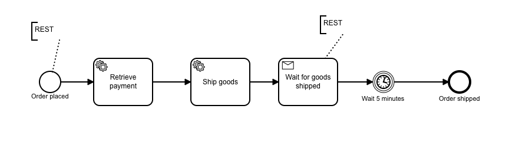

# camunda-microservice
Simple spring boot application to understand Camunda as micro services

Process Defination

To start the process , we need a rest call the rest serevice using the following command

 `curl -d “orderId=21&amount=400” -X POST http://localhost:8080/order`

This will start a new instance and we need to confirm the shipment using the below command

`curl -d “orderId=21” -X POST http://localhost:8080/confirm`
